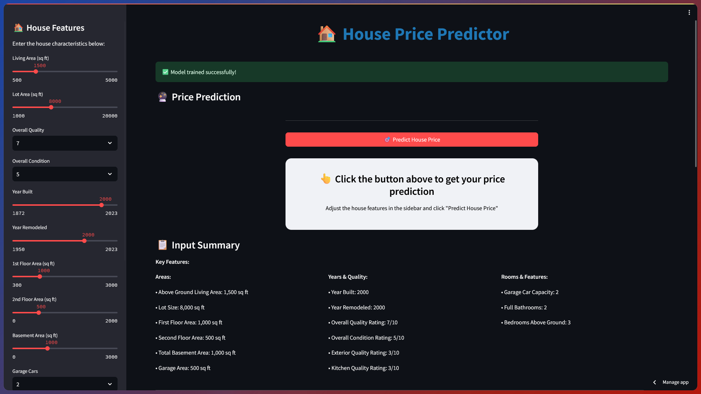
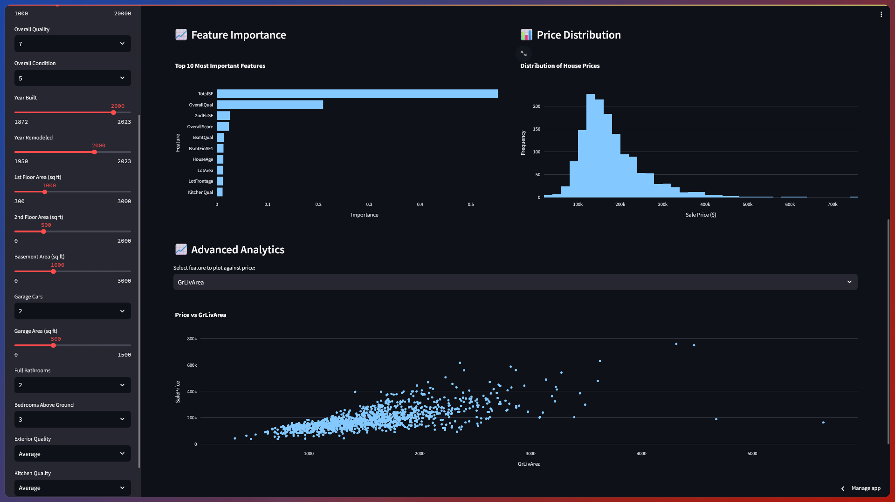

# 🏠 House Price Prediction Streamlit App

A comprehensive web application for predicting house prices using machine learning, deployed with Streamlit.

## 🌐 Live Demo

**🔗 [Try the App Live on Streamlit Cloud](https://ml-housepriceprediction.streamlit.app)**

---




---

## 📁 Project Structure

```
PWD/
├── app.py                 # Main Streamlit application
├── requirements.txt       # Python dependencies
├── train.csv             # Training dataset
├── test.csv              # Test dataset
└── README.md            # This file
```

## 🚀 Quick Start

### 1. Install Dependencies

```bash
pip install -r requirements.txt
```

### 2. Run the Application

```bash
streamlit run app.py
```

### 3. Access the App

Open browser and navigate to `http://localhost:8501`

## ✨ Features

### 🎛️ User Interface

- **Interactive Sidebar**: Input house characteristics using sliders and dropdowns
- **Enhanced Prediction Button**: Large, prominent button with visual feedback and loading spinner
- **Input Validation**: Real-time validation with helpful warnings for unusual values
- **Professional Design**: Modern, responsive interface with custom CSS styling and hover effects

### 📊 Analytics & Visualizations

- **Feature Importance Charts**: Understand which features impact prices most
- **Price Distribution Analysis**: Explore market price patterns
- **Correlation Matrices**: Visualize relationships between features
- **Residual Analysis**: Assess model performance and quality
- **Interactive Plots**: Plotly-powered charts with zoom and hover capabilities (fixed update_layout compatibility)

### 🤖 Machine Learning Pipeline

- **Automated Data Processing**: Missing value handling and feature engineering
- **Feature Selection**: Statistical tests to identify most predictive features
- **Model Training**: Multiple algorithm comparison (Random Forest, Linear models, etc.)
- **Performance Metrics**: RMSE, R², and cross-validation scores with confidence indicators

### 🏡 Enhanced Prediction Features

- **Smart Input Validation**: Automatic checking for reasonable input ranges
- **Confidence Indicators**: Visual confidence levels for predictions
- **Price Range Estimates**: 90%-110% confidence intervals
- **Market Positioning**: Premium/Value/Market Rate classifications
- **Visual Feedback**: Loading spinners and success/error messages
- **Comprehensive Metrics**: Delta comparisons with market averages

### 🏡 Input Features

- Living Area (sq ft)
- Lot Area (sq ft)
- Overall Quality (1-10)
- Overall Condition (1-10)
- Year Built
- Year Remodeled
- Number of Bedrooms
- Number of Bathrooms
- Garage Details
- And many more...

## 📈 Application Sections

### Main Dashboard

- **Data Overview**: Dataset statistics and sample data
- **Model Performance**: Accuracy metrics and validation scores
- **Feature Importance**: Charts showing most influential features

### Prediction Interface

- **Input Panel**: User-friendly controls for house features
- **Price Prediction**: Large, prominent price display
- **Market Comparison**: Compare with average market prices
- **Price Range**: Confidence intervals for predictions

### Advanced Analytics

- **Price vs Features**: Scatter plots and relationships
- **Correlation Analysis**: Feature correlation heatmaps
- **Residual Analysis**: Model quality assessment plots

## 🔧 Technical Details

### Data Processing

- **Missing Value Handling**: Domain-specific strategies for different feature types
- **Feature Engineering**: Creation of derived features (house age, total area, etc.)
- **Categorical Encoding**: Ordinal encoding for quality features, one-hot for nominal
- **Feature Scaling**: RobustScaler for handling outliers

### Model Architecture

- **Algorithm**: Random Forest Regressor (configurable)
- **Feature Selection**: SelectKBest with statistical tests
- **Validation**: 5-fold cross-validation
- **Optimization**: Caching for improved performance

### Performance Optimization

- **@st.cache_data**: Cached data loading and preprocessing
- **@st.cache_resource**: Cached model training
- **Error Handling**: Comprehensive exception handling
- **Input Validation**: User input sanitization and validation

## 🌐 Deployment Options

### Local Development

```bash
streamlit run app.py
```

### Streamlit Community Cloud

1. Push code to GitHub repository
2. Visit [share.streamlit.io](https://share.streamlit.io)
3. Connect GitHub and deploy

## 📊 Model Performance

- **Features Used**: 50 most important features (auto-selected)
- **Training Time**: 2-5 seconds (cached after first run)

## 🎯 Use Cases

- **Real Estate Professionals**: Quick property valuations
- **Home Buyers**: Market price estimates
- **Property Investors**: Investment decision support
- **Academic Research**: ML model deployment demonstration
- **Portfolio Projects**: Showcase of full-stack ML application

## 📝 Notes

- The model is trained on the Ames Housing dataset
- Predictions are estimates and should not be used as definitive valuations
- The application includes proper error handling and user feedback
- All visualizations are interactive and responsive

---

**Built with ❤️ By Avinash Yadav**
